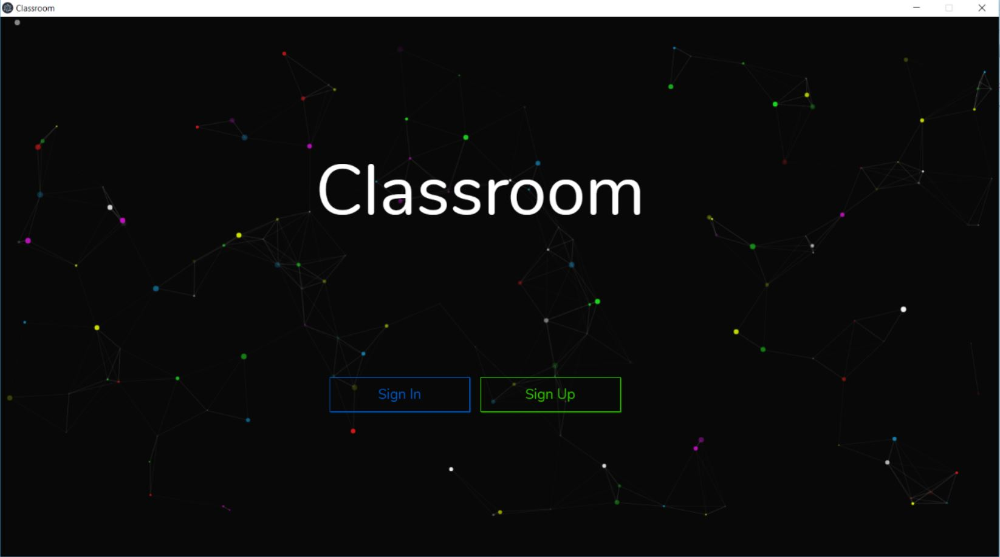
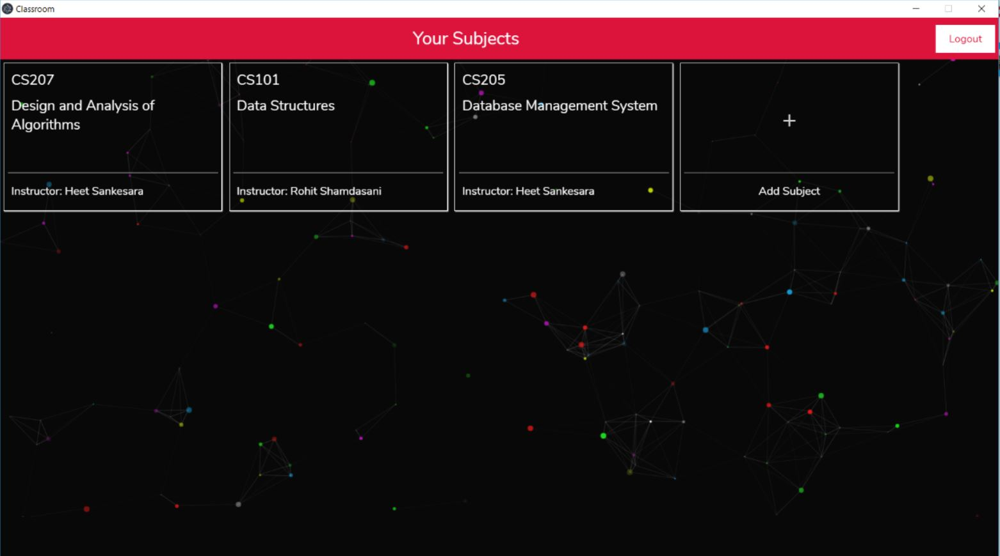
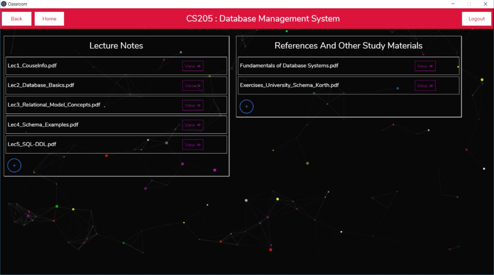
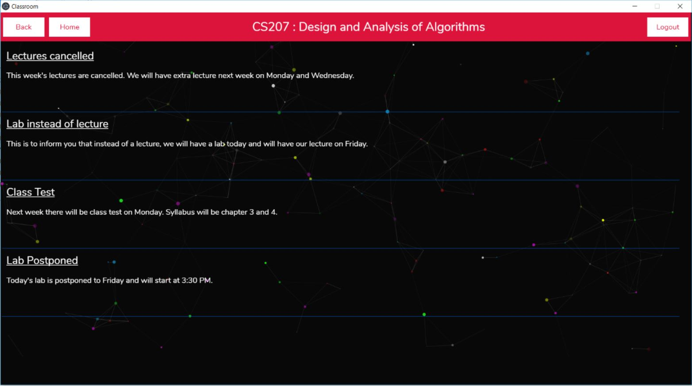
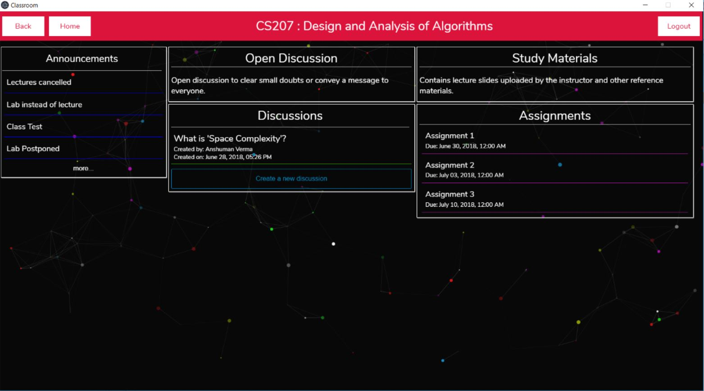
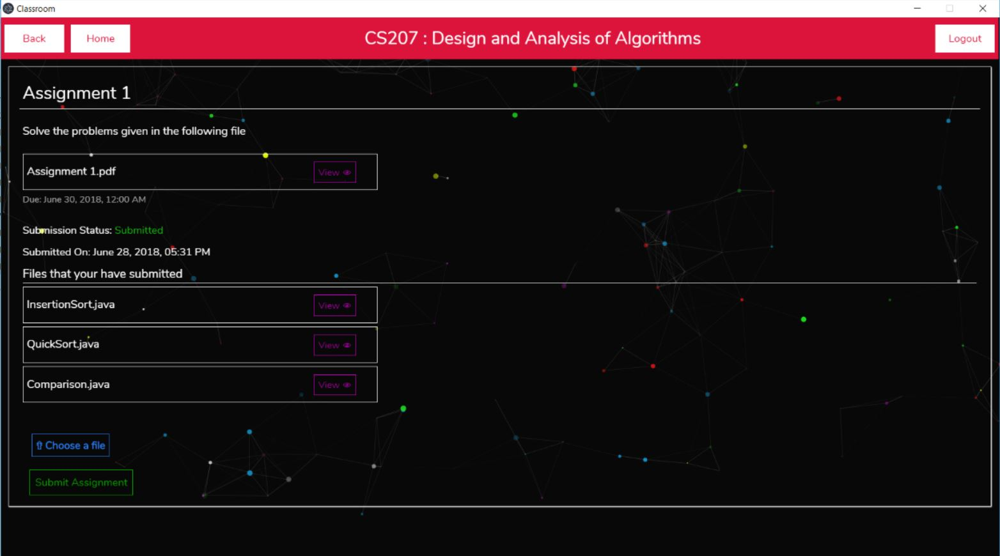
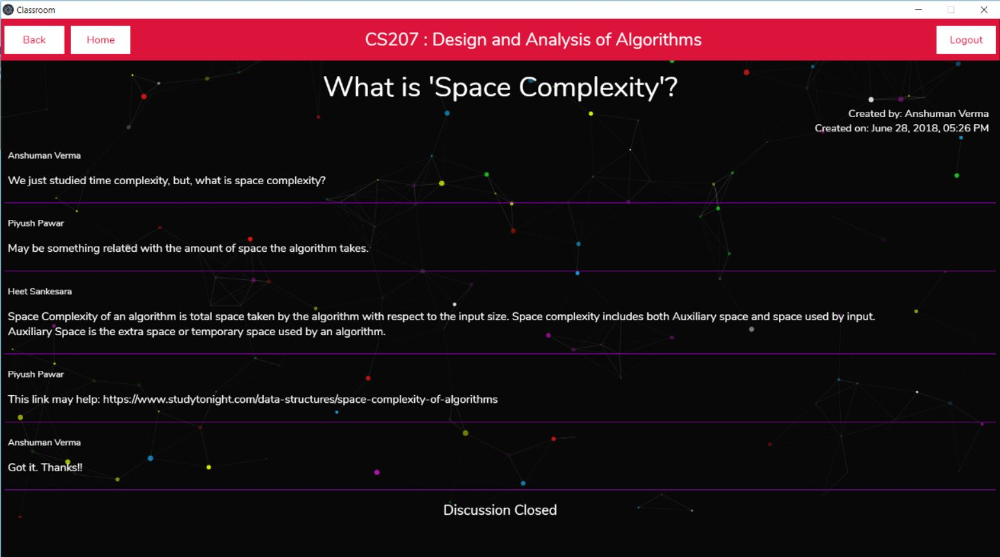
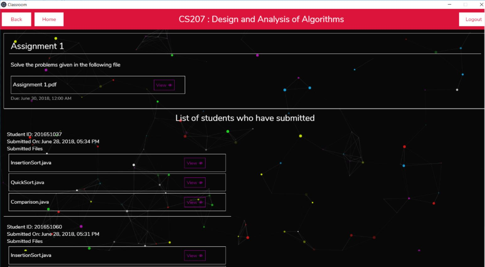

# Classroom
An electron app similar to Google Classroom.

### Development

- Clone Repository
```
git clone https://github.com/PiyushPawar17/classroom.git
cd classroom
```

- Install Dependencies
```
npm install
```

- Set Up Firebase
	- Create a firebase project from firebase console.
	- Create a `.env` file at the root with following data.
	```
	REACT_APP_FIREBASE_API_KEY=<Your_Firebase_API_Key>
	REACT_APP_FIREBASE_AUTH_DOMAIN=<Your_Firebase_Auth_Domain>
	REACT_APP_FIREBASE_DATABASE_URL=<Your_Firebase_Database_URL>
	REACT_APP_FIREBASE_PROJECT_ID=<Your_Firebase_Project_ID>
	REACT_APP_FIREBASE_STORAGE_BUCKET=<Your_Firebase_Storage_Bucket>
	REACT_APP_FIREBASE_MESSAGING_SENDER_ID=<Your_Firebase_Messaging_Sender_ID>
	```
	Note: You must create custom environment variables beginning with `REACT_APP_`. Visit [here](https://github.com/facebook/create-react-app/blob/master/packages/react-scripts/template/README.md#adding-development-environment-variables-in-env) for more information.

- Run
```
npm start
```
------------------------------------------------------------------

To prevent the browser from opening set `BROWSER=none` in the `.env` file.

## Screenshots

Sign-In / Sign-Up Page



Subscribed Subjects



Lecture Notes and References (Teacher's View)



Announcements Page (Student's View)



Subject's Home Page (Student's View)



Assignment Page (Student's View)



Discussion Forum



Assignment Page (Teacher's View)


